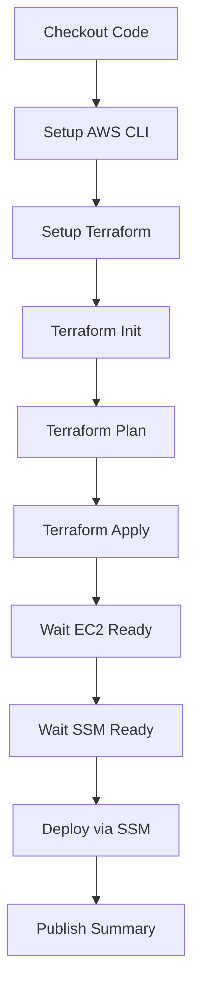

# 🚀 Projeto DevOps + IA

Uma aplicação **Streamlit** containerizada com **deploy automatizado** na AWS usando **Infraestrutura como Código**.

---

## 📋 Sobre o Projeto

Este projeto demonstra uma implementação completa de **DevOps** para uma aplicação de IA, incluindo:

- **Aplicação**: Interface web desenvolvida em Streamlit (Python 3.12)  
- **Containerização**: Docker e Docker Compose  
- **Infraestrutura**: AWS (EC2, VPC, Security Groups, IAM, Secrets Manager)  
- **IaC**: Terraform para provisionamento de recursos  
- **CI/CD**: GitHub Actions para deploy automatizado  
- **Segurança**: AWS SSM para execução remota sem SSH direto  

---

## 🏗️ Arquitetura

```text
┌─────────────────┐    ┌──────────────────┐    ┌─────────────────┐
│   GitHub Repo   │───▶│ GitHub Actions   │───▶│   AWS Cloud     │
│                 │    │                  │    │                 │
│ • Código fonte  │    │ • Terraform      │    │ • EC2 Instance  │
│ • Dockerfile    │    │ • AWS CLI        │    │ • VPC + Subnets │
│ • Terraform     │    │ • Deploy via SSM │    │ • Security Group│
│ • GitHub Actions│    │                  │    │ • Secrets Mgr   │
└─────────────────┘    └──────────────────┘    └─────────────────┘
                                                         │
                                                         ▼
                                               ┌─────────────────┐
                                               │   Streamlit App │
                                               │   (Port 8501)   │
                                               │                 │
                                               │ • Docker        │
                                               │ • Python 3.12   │
                                               │ • Auto-restart  │
                                               └─────────────────┘
```

---

## ⚡ Recursos AWS Utilizados

- **EC2**: Instância `t3.micro` com Ubuntu 22.04  
- **VPC**: Rede privada com subnets públicas em 2 AZs  
- **Security Groups**: Firewall permitindo SSH (22) e Streamlit (8501)  
- **Elastic IP**: IP público fixo  
- **IAM**: Perfis e políticas para SSM  
- **Secrets Manager**: Armazenamento seguro de chaves privadas  
- **Systems Manager (SSM)**: Deploy remoto sem SSH  

---

## 🛠️ Pré-requisitos

### AWS
- Conta AWS com permissões para EC2, VPC, IAM, SSM e Secrets Manager  
- Bucket S3 para armazenar o estado do Terraform  
- Região configurada (**padrão**: `us-east-1`)  

### GitHub
Configurar os seguintes **secrets** no repositório:  
- `AWS_ACCESS_KEY_ID`  
- `AWS_SECRET_ACCESS_KEY`  
- `GMS_GITHUB_TOKEN_USER`  
- `GMS_GITHUB_TOKEN`  
- `GEMINI_TOKEN` (se aplicável)  

### Local (opcional – desenvolvimento)
- Docker e Docker Compose  
- Terraform >= 1.0  
- AWS CLI  
- Python 3.12+  

---

## 🚀 Como Fazer o Deploy

### 1. Configurar Backend do Terraform
Edite o arquivo `terraform/backend.tf` com seu bucket S3:

```hcl
terraform {
  backend "s3" {
    bucket = "seu-bucket-terraform-state"
    key    = "envs/projeto/terraform.tfstate"
    region = "us-east-1"
  }
}
```

### 2. Configurar Variáveis de Ambiente
Crie um arquivo `.env` na raiz do projeto:

```env
# Configurações da aplicação
GEMINI_TOKEN=your_gemini_api_token
GMS_GITHUB_TOKEN=your_github_token
GMS_GITHUB_TOKEN_USER=your_github_username

# Outras variáveis específicas da aplicação
APP_DEBUG=false
APP_PORT=8501
```

### 3. Executar o Deploy
1. Acesse **Actions** no GitHub  
2. Selecione **Deploy IaC - Deploy Docker With AWS SSM**  
3. Clique em **Run workflow**  
4. Escolha a branch (padrão: `master`)  
5. Aguarde a conclusão do pipeline  

### 4. Acompanhar o Progresso
O pipeline executa as seguintes etapas:



---

## 📱 Acessando a Aplicação

Após o deploy bem-sucedido:  

1. Verifique o **Job Summary** no GitHub Actions  
2. Localize o **IP Público da EC2**  
3. Acesse no navegador:

```
http://SEU_IP_PUBLICO:8501
```

---

## 🔧 Desenvolvimento Local

### Instalação
```bash
# Clonar repositório
git clone <seu-repositorio>
cd projeto-devops-ia

# Criar ambiente virtual
python -m venv venv
source venv/bin/activate  # Linux/Mac
# ou
venv\Scriptsctivate     # Windows

# Instalar dependências
pip install -r requirements.txt
```

### Executar Localmente
```bash
# Via Python
streamlit run app.py

# Via Docker
docker compose up --build
```

A aplicação estará disponível em http://localhost:8501

---

## 📁 Estrutura do Projeto

```
projeto-devops-ia/
├── .github/
│   └── workflows/
│       └── deploy.yml          # Pipeline CI/CD
├── terraform/
│   ├── main.tf                 # Recursos principais
│   ├── variables.tf            # Variáveis
│   ├── outputs.tf              # Outputs
│   └── backend.tf              # Configuração do backend
├── app/
│   ├── app.py                  # Aplicação Streamlit
│   └── requirements.txt        # Dependências Python
├── Dockerfile                  # Imagem Docker
├── docker-compose.yml          # Orquestração
├── .env.example                # Exemplo de variáveis
└── README.md                   # Este arquivo
```

---

## 🔒 Segurança

- **Sem SSH direto**: Deploy via AWS SSM Run Command  
- **Chaves privadas** armazenadas no **AWS Secrets Manager**  
- **Secrets** sensíveis em **GitHub Secrets**  
- **Firewall** via Security Groups restritivos  
- **IAM** com princípio do menor privilégio  

---

## 🐛 Troubleshooting

**Erro: "EC2 instance not ready"**  
- Aguarde alguns minutos para a instância inicializar  
- Verifique se a instância está rodando no console AWS  

**Erro: "SSM agent not registered"**  
- A instância pode levar até 5 minutos para se registrar no SSM  
- Verifique o IAM Instance Profile  

**Erro: "Application not accessible"**  
- Confirme se o Security Group permite tráfego na porta 8501  
- Verifique se o container está rodando: `docker ps`  

**Erro: "Terraform state lock"**  
- Aguarde ou force unlock:  
```bash
terraform force-unlock <LOCK_ID>
```

---

## 🤝 Contribuição

1. Fork o projeto  
2. Crie uma branch para sua feature (`git checkout -b feature/AmazingFeature`)  
3. Commit suas mudanças (`git commit -m 'Add some AmazingFeature'`)  
4. Push para a branch (`git push origin feature/AmazingFeature`)  
5. Abra um Pull Request  

---

## 📝 Licença
Este projeto está sob a licença MIT. Veja o arquivo [LICENSE](LICENSE) para detalhes.  

---

## 🎯 Roadmap

- [ ] Implementar monitoramento com CloudWatch  
- [ ] Adicionar testes automatizados  
- [ ] Configurar SSL/HTTPS  
- [ ] Implementar backup automatizado  
- [ ] Adicionar ambiente de staging  
- [ ] Configurar alertas de saúde da aplicação  

---

## 📞 Suporte

- Verifique a documentação de deploy  
- Consulte as issues existentes  
- Abra uma nova issue se necessário  

---

**Desenvolvido com ❤️ para demonstrar as melhores práticas de DevOps e IA**
